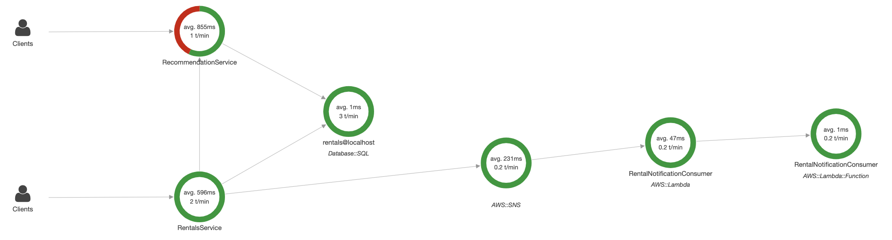

# Acme Rentals: Pedestal XRay example

This project implements a fictional video rental service in order to
demonstrate various tracing concepts with AWS XRay.

Acme Rentals is a system which consists of two logical services: a
rental service and a recommendation service. The services use a single
postgreSQL database as their data store. The rental service sends out
rental notifications via AWS SNS.


The services are implemented within a single pedestal service
process for demo purposes.

The recommendation service is implemented to simulate latency and
instability.

## Tracing concepts covered

- Segment/Subsegment creation using `pedestal.log` and `pedestal.aws`.
- Cross-service tracing.
- Addition of segment annotations/metadata including AWS-specific
  metadata.
- Tracing AWS sdk clients.
- Tracing PostgreSQL interactions.

# Running the demo

It is expected that you will run the system locally via `lein run` or
`lein run-dev`.

An Emacs [restclient](https://github.com/pashky/restclient.el) script
is provided for interacting with the system.

## Prerequisites

The following host entries are required:

```
127.0.0.1		localhost rentals.acmevideos.com recommendations.acmevideos.com
```

The following environment variables are required:

- `AWS_ACCESS_KEY_ID`
- `AWS_SECRET_ACCESS_KEY`
- `AWS_REGION`
- `PEDESTAL_TRACER` (set to `io.pedestal.log.aws.xray/tracer`)
- `SNS_TOPIC_ARN`
- `DB_HOST`
- `DB_PORT`
- `DB_NAME`
- `DB_USERNAME`
- `DB_PASSWORD`

A PostgreSQL database with the sample database from
[postgresqltutorial](http://www.postgresqltutorial.com/postgresql-sample-database/)
installed.


A running Docker container of [X-Ray
Daemon](https://docs.aws.amazon.com/xray/latest/devguide/xray-daemon-local.html).

```
$ docker run --name aws_xray --rm -p 2000:2000/udp \
--attach STDOUT \
-e AWS_ACCESS_KEY_ID=aws_access_key \
-e AWS_SECRET_ACCESS_KEY=aws_secret_key \
-e AWS_REGION=aws_region \
namshi/aws-xray --local-mode
```

Optionally, you can also provision a lambda which consumes messages
from the specified SNS topic (`SNS_TOPIC_ARN`) to observe how tracing
propagates to the Lambda function invocation.

## Using the AWS XRay interface

After running through the demo script, your XRay service map will look
something like this:



**Note**: If you don't see errors, execute the requests which retrieve a
movie by id a few times. The rental service interacts with the
recommendations service when retrieving a movie by id. The
recommendation service should fail ~25% of the time which results in
movie data returned without recommendations.

Explore the collected traces.

Try some filters:

Recommendation service faults filter

```
service("RecommendationService") { fault }
```

Filtering by an annotation.
```
(service("RentalsService")) AND http.url = "/movies" AND annotation.title = "Splash"

```
